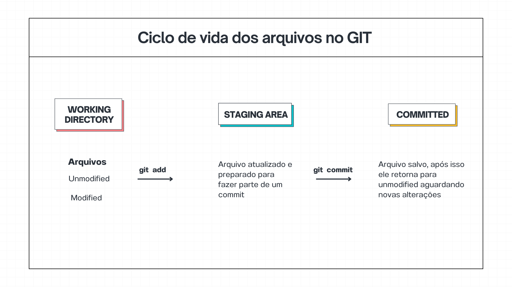

# Ciclo de vida dos arquivos no GIT

- git init
  
  inicializa um novo repositório do Git.

> **Arquivo unmodified e modified**
> 
> sem modificação / modificado
> 
> **Arquivo untracked**
> 
> arquivo recém criado

- git add
  
  move o arquivo untrecked ou modified direto para o staged, dessa forma ele está se preparando para fazer parte de um commit.

- git commit
  
  cria um snapshot (foto) do código naquele momento. Depois os arquivos retornam para unmodified aguardando um novo ciclo de etapas.

- git status
  
  permite vizualizar qual o estado atual do arquivo, em etapa do ciclo ele se encontra.

